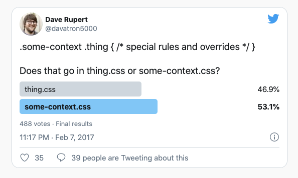
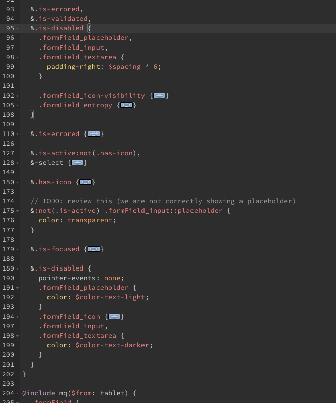

<style>
strong {
--dracula-current-line:#f1fa8c;
color: #f1fa8c;
}

</style>

<style scoped>
section h1 {
    text-align: center;
    height: 100%;
    line-height: 6;
    font-size: 250%;
    text-shadow: 0px 0px 118px rgba(255, 121, 198, 1);
}
</style>


# Arquitectura **CSS**
---
# Índice
+ Principio de responsabilidad única
+ Principio de fuente de única verdad
+ Open / Close
+ Code smell, pitfalls y buenas prácticas
---
# <!-- fit --> Principio de responsabilidad única (**S**OLID)

Establece que cada clase debe tener una sola responsabilidad, y que la responsabilidad debe estar completamente encapsulada por la clase. 

Todos sus servicios deben estar estrechamente alineados con esa responsabilidad.

<!-- Por eso utilizamos BEM B = BLOQUE -->

--- 
<!-- header: SRP (Principio de responsabilidad única) -->
## Ejemplo SRP

```html
<a href="/product" class="promo">Buy now!</a>
```
```css
.promo {
display: block;
padding: 20px;
margin-bottom: 20px;
background-color: #09f;
color: #fff;
text-shadow: 0 0 1px rgba(0,0,0,0.25);
border-radius: 4px;
}
```
<!-- 

* Tenemos una clase para estilizar una caja con contenido promocional. Aquí estamos haciendo 2 cosas a la vez:

* Estamos definiendo un  **un modelo de caja con una estructura** 
* Estamos definiendo estilos  **cosméticos** (color, etc).
-->

---

Podríamos hacer un refactor para cumplir con el SRP , separando nuestro código en 2 clases

```css
.island {
display: block;
padding: 20px;
margin-bottom: 20px;
}

.promo {
background-color: #09f;
color: #fff;
text-shadow: 0 0 1px rgba(0,0,0,0.25);
border-radius: 4px;
}

```

<!--
Ahora tenemos 2 clases y cada una lleva su responsabilidad única

.island se encarga de meter el contenido*  en una caja 

.promo aplica nuestro estilo promocional
-->

---

#  otro ejemplo 
```css
.journey_finishReasonIcon {
  display: inline-table;
  width: 16px;
  height: 16px;
  color: red;
  transform: translateY(1px);
}
```
```html
<div class="journey_finishReasonIcon"> error icon</div>
```

---

```html
<div class="journey_finishReasonIcon"> error icon</div>
<div class="journey_finishReasonIcon journey_finishReasonIcon-success"> success icon</div>
```

```css
.journey_finishReasonIcon-success {
    color: green;
  }
```
```html
<div class="journey_finishReasonIcon journey_finishReasonIcon-error"> error icon</div>
<div class="journey_finishReasonIcon journey_finishReasonIcon-success"> success icon</div>
```


<!--
* 1./ Deberíamos extraer el atributo color y crear un modificador para error. 

* 2./ otro punto que no es tan evidente =>  podríamos extraer nuestra clase en un elemento común agnóstico al contexto.

* Y por último en el elemento agnóstico no deberíamos de utilizar `display:inline-table`
-->

---
## Beneficios
- Tu CSS es mucho más DRY
- Podemos realizar cambios de **gran alcance**, simplemente modificando una abstracción base **una única vez**.
- Podemos hacer cambios más seguros porque sabemos que cuando editamos una clase solo estamos alterando una responsabilidad.
- Podemos combinar responsabilidades para crear una variedad de componentes a partir de muchas clases abstractas.

---

<!-- header: SSOT (Principio de fuente de única verdad) -->

# Principio de fuente de única verdad
+ SSOT es la práctica de estructurar modelos de información y esquemas de datos asociados, de manera que cada elemento de datos se domine **(o edite)** en un solo lugar.

+ Los sistemas SSOT proporcionan datos que son auténticos, relevantes y **referenciables**.

---

# principio abierto / cerrado (S**O**LID) 

Cualquier elemento HTML en una página debe estar **abierto para su extensión** mediante modificadores, pero **cerrado para cambios**.

Deberíamos poder desarrollar nuevas implementaciones de CSS sin necesidad de cambiar las existentes.

---
### Uso de modificador 

```html
    <button class="button">...</button>
    <button class="button button-small">...</button>
```
```css
.button {
    font-family: Arial, sans-serif;
    text-align: center;
    font-size: 11px;
    line-height: 20px;
}

.button-small {
    font-size: 13px;
    line-height: 24px;
}
```
<!--
La funcionalidad del botón existente se amplía utilizando la clase button-small (se redefinen las propiedades de tamaño de fuente y altura de línea). Ahora la página tiene dos botones de diferentes tamaños.
-->

---

### Modificación por contexto 
```css
.button {
    font-family: Arial, sans-serif;
    text-align: center;
    font-size: 11px;
    line-height: 20px;
}
.modal .button {
    font-size: 13px;
    line-height: 24px;
}
```
El diseño del botón ahora depende de su ubicación. Los cambios se aplicarán a todos los bloques de botones dentro de una modal

---
<!-- header: '' -->

## <!-- fit --> Cómo implementar principios BEM en nuestros proyectos

* Dejar de lado el modelo DOM **(disociar el HTML de los estilos)**

* No utilizar selectores de ID o selectores de **etiquetas**.

* Minimizar el número de selectores anidados.

* Utilizar la convención de nomenclatura de clases CSS para evitar colisiones de nombres y hacer que los nombres de los selectores sean lo más informativos y claros posible.


---
<!-- header: Cómo implementar principios BEM en nuestros proyectos -->

* Mover las propiedades CSS de un bloque a **modificadores** si parece probable que se modifiquen.

* Utilizar mezclas  **MIX BEM** (mixings funcionales)

* Dividir el código en pequeñas partes independientes para facilitar el trabajo con bloques individuales.

* Reutilizar bloques.

---
### Mixings funcionales con BEM ( MIX )

````html
<article class="article">...</article>

<footer class="footer">
    <div class="copyright">...</div>
</footer>
````

````css
.article, .footer div {
font-family: Arial, sans-serif;
font-size: 14px;
color: #000;
}
````

<!-- 

* En este ejemplo, el texto dentro del artículo y los bloques de copyright tienen el mismo color y fuente.

* Aunque los selectores de grupo le permiten cambiar rápidamente el diseño de la página, este enfoque refuerza el acoplamiento de código.

* Esta es la razón por la que BEM usa los MIX (o mezclas) para formatear uniformemente un conjunto completo de elementos HTML.
-->

---

### Implementación correcta
```html
<article class="article text">...</article>

<footer class="footer">
    <div class="copyright text">...</div>
</footer>
```
````css
.text {
    font-family: Arial, sans-serif;
    font-size: 14px;
    color: #000;
}
````
---
## Colocar un bloque dentro de otro bloque

En la metodología BEM, la **posición** de un bloque en la página se establece en el bloque principal. Esto permite que los bloques sean independientes y reutilizables.

---
```html
<header class="header"> <!-- `header` block -->
      <button class="button header__button">...</button>
</header>
```
```css
.button {
font-family: Arial, sans-serif; text-align: center;
border: 1px solid black;    /* Frame */
}
.header__button {
margin: 30px;               /* Padding */
position: relative;
}
```

<!--
* En este ejemplo, la geometría externa y el posicionamiento del bloque de botones se configuran mediante el elemento header__button. 

* El bloque de botones no especifica ningún margen, por lo que se puede reutilizar fácilmente en cualquier lugar.
-->

---
<!-- header: '' -->
# Code smell & pitfalls 

#### uso de @extend 💩
   + Altera el orden de los sources
   + Crea agrupaciones incómodas en el código, juntando selectores no relacionados.
   + Puede descontrolarse mucho y muy rápido. 
   + El uso de @extend está desaconsejado. 
   + **Usar Mixins de BEM** 

---
<!-- header: 'code smell and pitfalls' --> 
@extend .data-ico (32)

```css
.data-ico {
 margin-top: -2px; vertical-align: middle; text-transform: none; 
    font-family: iconfont;font-weight: 400; font-style: normal; font-variant: normal;
    -webkit-font-smoothing: antialiased;
    -moz-osx-font-smoothing: grayscale;
    line-height: 1; speak: none
}
```

```css

.back-arrow-button:before, .button-more-icon:before, .contextualMenu-handler:before, .data-ico-after:after, 
.data-ico:before,.detailOverview .driverOverview_rating:after, .driverJourneyStatus-ongoingJourney:before,
.driverJourneyStatus-searching:before, .dropdown .select-button:after, .dropdown-button:after, .dropdown-overlay-close:before,
.filterField .input-reset:before, .filterField-search:before,.journey-details-call:before, 
.journey-details-list .call-tooltip:before,.journey-panel .destination-icon:before, .journey-panel .origin-icon:before,
.journey-panel .vehicle-icon:before,.journey-state-collapsible:before, .mainmenu-logo:before, .map-direction:before,
.rating .star.half:after,.rating .star:before, .reminderNotification-message:before,.statusBadge.iconInfo:before,
.table-col-ellipsisWrapper.table-m-icon:before, .table-col-userState:before,.table-fileIcon:before,
.table-tooltipIcon:before,.tableListing-actions-addAction:before, .tooltip-innerWrapper:before,.tooltip-tip:before,
.topNotification-close:before, .topNotification-message:before {

```
---
#### Uso de @includes (SCSS) 💩
+ son opacos
+ nos hacen pensar de forma erronea (en vez de componer , heredamos)
+ hay excepciones en los archivos core o en funciones que usen estos includes
+ favorecer el **uso de mixins de BEM** en vez de  @includes

---
`@include typography("body");`

```scss
.driverSuggestionRow_driverName {
 @include typography("body");
 margin-left: 16px;
}
/* se traduce en esto */
.driverSuggestionRow_driverName {
 margin-left: 16px
}
@media all {
 .driverSuggestionAutocomplete_noResults, .driverSuggestionRow_driverName {
  letter-spacing: -.01em;
  font-size: .875rem;
  line-height: 1.43
 }
}
@media(max-width:47.99em) {
 .driverSuggestionAutocomplete_noResults,.driverSuggestionRow_driverName {
  letter-spacing: -.01em;
  font-size: 1rem;
  line-height: 1.5
 }
}
```

---

ya tenemos unas clases util 🥳
```css
@media all {
 .text-body { letter-spacing: -.01em; font-size: .875rem; line-height: 1.43}
}
@media(max-width:47.99em) {
 .text-body {letter-spacing: -.01em; font-size: 1rem; line-height: 1.5}
}
```
  * ✅ SRP
  * ✅ SSOT
  * ✅ O/C   
  * 😱 important!
  * 🤔 inmutabilidad

--- 
#### CSS Sintaxis abreviadas (shorthands)   💩
```css
    .btn { background: red; }
    /* Es equivalente a */
    .btn {
        background-image: initial;
        background-position-x: initial;
        background-position-y: initial;
        background-size: initial;
        background-repeat-x: initial;
        background-repeat-y: initial;
        background-attachment: initial;
        background-origin: initial;
        background-clip: initial;
        background-color: red;
    }
```
<!--
* Siempre favorecer la forma explícita. Será más texto , más repetitivo menos DRY pero es más preciso 

* Escribir sólo lo que necesitemos. La mayoría de los problemas de CSS se deben al uso excesivo de reglas

* Existen excepciones por ejemplo en margin y padding. 

* No utilizar la forma abreviada de 3 datos (padding: t l b)

* lo mismo pasa con la propiedad `flex:100% ==> flex: flex-grow flex-shrink flex-basis`
-->

---
#### Dónde escribir el código 🤔

+ Principio de fuente de única verdad




---

#### Un ejemplo más cercano
```css
.btn { [styles] }
.modal .btn { font-size: 0.75em; }
```

+ Debemos intentar agrupar nuestros estilos basados en el sujeto (es decir, el selector clave). 
  
+ En este ejemplo, el sujeto es .btn: eso es lo que realmente nos importa. 

+ .modal es puramente un contexto para .btn, por lo que no le estamos aplicando ningún estilo.

---
<!--
* Es mucho más conveniente tener el contexto de todos nuestros botones en un solo lugar. Si quiero obtener una buena descripción general de todos los estilos de botones en mi proyecto, debería esperar solo tener que abrir un .buttons.scss, y no una docena de archivos más.

* Esto hace que sea mucho más fácil mover todos los estilos de botones a un nuevo proyecto, pero lo que es más importante, alivia la sobrecarga cognitiva.
-->
+ Como regla general, nos podemos preguntar: ¿estoy diseñando x o estoy diseñando y? Si la respuesta es x, entonces el CSS debería vivir en x.css; si la respuesta es y, debería vivir en y.css.

+ La alternativa a SSOT en el caso anterior sería **escribir BEM MIX**

---

#### Selectores claves apareciendo en más de un sitio  💩
```css
.btn {}
.header .btn, .header .btn:hover {}
.sidebar .btn {}
.modal .btn {}
.page aside .btn {}
nav .btn {}
```
+ no hay un SSOT en donde referenciar cómo se comporta mi botón 🥺
+ Existen muchas mutaciones de btn 👿
+ Solución: Usar modificadores ✅

---


#### MIX BEM

```css
/* _components.buttons.scss */
.btn { [styles] }
.modal .btn { [styles] }
/* _components.modal.scss */
.modal { [styles]}
```
```css
/* _components.buttons.scss */
.btn {[styles]}
/* _components.modal.scss */
.modal { [styles] }
.modal__btn { [styles] }
```
```html
<div class="modal"><button class="btn  modal__btn">Dismiss</button></div>
```
---

+ Esto se denomina una mezcla BEM (MIX BEM), en la que introducimos una tercera clase nueva para referirnos a un botón que pertenece a un modal. 
* Esto evita la cuestión de dónde viven las cosas 
* Reduce la especificidad al evitar el anidamiento
* previene la mutación al evitar repetir la clase .btn nuevamente.

---
#### Números mágicos 💩

+ tenemos muchos magic numbers en el código por ejemplo en los paddings

* `padding: $spacing * 2` sigue siendo un número mágico y no me aporta ninguna información 🤷‍ 
* Si el pading fuera 0 ¿debería hacer => `padding: $spacing * 0` 🤮
* `padding: $no-space` , `padding: $space`, `padding: $space-large`  me dan más información ✅ 
* esto es consecuencia de no tener definido un ritmo vertical en la aplicación 🥺

--- 
#### Selectores cualificados 💩
```css
ul.nav {}
a.button {}
div.header {}
```
+ Inhiben totalmente la reutilización en otro elemento.
+ Aumentan la especificidad.
+ Aumentan la carga de trabajo del navegador (disminuyen el rendimiento).

---

### <!-- fit --> No usar comas para múltiples selectores 🤮


<!-- 
formField_placeholder, formField_input, formField_textarea
-->
+ 2 fuentes de verdad
+ Difícil de leer
+ difícil de mantener

---

#### <!-- fit --> Modificadores de clases `is-* , has-*` , no se aconseja en [BEM](http://getbem.com/faq/#why-the-modifier-classes-are-prefixed)

Mejor usar prefijo de clase

```HTML
<div class="block">Lorem Ipsum</div>
<div class="block is-important">Lorem Ipsum</div>
<div class="block is-important news">Lorem Ipsum</div>
```
```css
.block {display:block;}
.block.is-important {font-weight: bold;}

.news { font-size: 14px;}
.news.is-important {color:red;}
```
```HTML
<InputField fieldWrapperClass="formField filterField has-leadingIcon"></InputField>
```

<!--
Al aplicar el modificador como usa el mismo nombre en los 2 bloques esto hace que se apliquen los 2 modificadores
-->

---

<!-- header: '' --> 
# Takeaways 🌟

* SRP , SSOT ,O/C  👑
* Utilizar modificadores 🤴
* Componer con Mixins 🤴

* #### Cómo ordenar nuestros archivos fuentes 
* ... to be continue

---

Bibliografía:
+ [Contextual styling](https://csswizardry.com/2015/06/contextual-styling-ui-components-nesting-and-implementation-detail/)
+ [SRP](https://csswizardry.com/2012/04/the-single-responsibility-principle-applied-to-css/)
+ [MIX BEM](https://en.bem.info/methodology/quick-start/#mix)
+ [css:display](https://hacks.mozilla.org/2019/10/the-two-value-syntax-of-the-css-display-property/)
+ [Composing blocks](https://en.bem.info/methodology/block-modification/#using-a-mix-to-change-a-block)
+ [code smell](https://csswizardry.com/2017/02/code-smells-in-css-revisited/)
+ [Mix Vs @extend](https://csswizardry.com/2016/02/mixins-better-for-performance/)
+ [Shorthand anti-pattern](https://csswizardry.com/2016/12/css-shorthand-syntax-considered-an-anti-pattern/)
+ [BEM why-the-modifier-classes-are-prefixed](http://getbem.com/faq/#why-the-modifier-classes-are-prefixed)

---

<style scoped>
p {
    text-align: center;
    font-size: 900%;
    line-height: 0;
    margin: 72px !important;
}
</style>

# <!-- fit --> Merry Christmas
🎅


