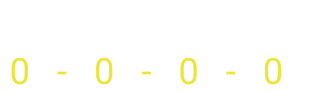
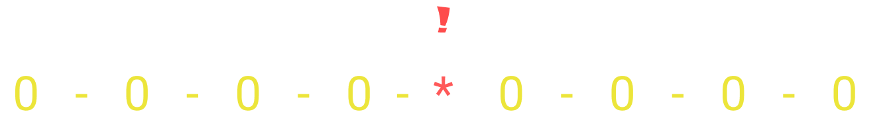
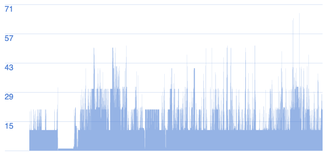

<style>
strong {
--dracula-current-line:#f1fa8c;
color: #f1fa8c;
}

</style>


## Índice
- Arquitecturas
- Problemas a resolver
  - especificidad
  - el orden de los ficheros
 
- ITCSS

---

SMACSS (Scalable and Modular Architecture for CSS)
The focus of SMACC is the organizable structure of your code.
5 categorías : 
* **Base** rules are the defaults. Essentially, a base style says that wherever this element is on the page
* **layout** rules divide the page into sections. Layouts hold one or more modules together.
* **modules** are the reusable, modular parts of our design. They are the callouts, the sidebar sections, the product lists and so on.
* **states** are ways to describe how our modules or layouts will look when in a particular state iso de !important recomendado
* **theme** are similar to state rules in that they describe how modules or layouts might look.

Nombrado:
* layout --> `l-*, layout-*`
* modules --> No usa porque es el bulk del proyecto   
* states --> `is-*`

---
OOCSS

OOCSS focuses on the code structure of your code
Divide layout into objects, then abstract their CSS into modules

two basic principles: separation of structure from skin and separation of containers and content.

```css
.btn {} 
.btn .btn-error{} 
.btn .active {}
```

OOCSS not only tries to separate the container from the content, but also separates the style from the structure.

BEM is an application of OOCSS. que nos permitirá eliminar el colapso de nombres a la vez que  aplana nuestra epsecificidad

```css
.btn {} 
.btn_error{} 
.btn_active {}
```

---
ITCSS
 Utiliza BEM y se basa en la inversión del triangulo (uso de nuestras reglas de CSS).
Tiene en cuenta la especificidad el **orden de inserción de las reglas** y la organización de los ficheros

---
Atomic
Create a class selector for every repeating CSS declaration

ACSS encourages developers to define single-purpose class selectors for every reusable declaration. Unlike OOCSS, which discourages CSS property values in class names, ACSS welcomes it
```css
.Mb\(16px\) { margin-bottom: 16px; }
.Mb\(32px\) { margin-bottom: 32px; }  
.C\(#1e90ff\) { color: #1e90ff; }
```
ejemplo Banco N26
```html
<div class="ac ax b ce fx fy lz mf mg nq nr ns nt nu q r">
    <div class="nv">
        <h1 class="cf ck id jq nw nx ny nz">The bank you’ll love</h1>
        <a href="#" class="aj av az ba bh ci dv ef ei el en eo ep eq er es et ev ga gb gc gd ge gf gn go gp gq gr gs hx ij ob oc od oe of og oh oi oj r">
   ...
```

---
Problemas a resolver: especificidad





---
Problemas a resolver: El orden de los ficheros

+ A igualdad de especificidad gana el último en ser parseado
  + archivo externo (normal, con preload, con carga asíncrona)
  + en la cabecera
  + en el cuerpo (inline)  

 + &lt;style&gt; Vs Inline => **inline**
 + &lt;link&gt; (preload, asíncrono, etc) **antes** &lt;style&gt; => **&lt;style&gt;**
 + &lt;link&gt; (preload, asíncrono, etc) **despues** &lt;style&gt; => **&lt;link&gt;**

---



---


ITCSS


---
### !important de forma proactiva 😁, no reactiva 😖

* !important está bien. Está bien y es una herramienta importante.
* Sin embargo, ! Important solo debe utilizarse en determinadas circunstancias.
* !important sólo debe usarse de forma proactiva, no reactiva.

* hay momentos en los que sabes que siempre, siempre querrás que un estilo tenga prioridad, y lo sabrás desde el principio.

```css
.error-text {
color: #cc0000 !important;
}
```

---
[Atomic CSS](https://acss.io/)
[CSS methodologies](https://www.creativebloq.com/features/a-web-designers-guide-to-css-methodologies#:~:text=OOCSS%20involves%20identifying%20objects%20on,place%2C%20leading%20to%20better%20consistency.)
_Less Web Development Essentials_, Bass Jobsen, ed: Packt Publishing
[SMACSS book](http://smacss.com/files/smacss-en.zip)
[Normalize Vs Reset](https://medium.com/@elad/normalize-css-or-css-reset-9d75175c5d1e)
[Managing projects with ITCSS](https://www.youtube.com/watch?v=1OKZOV-iLj4&t=8m44s)
