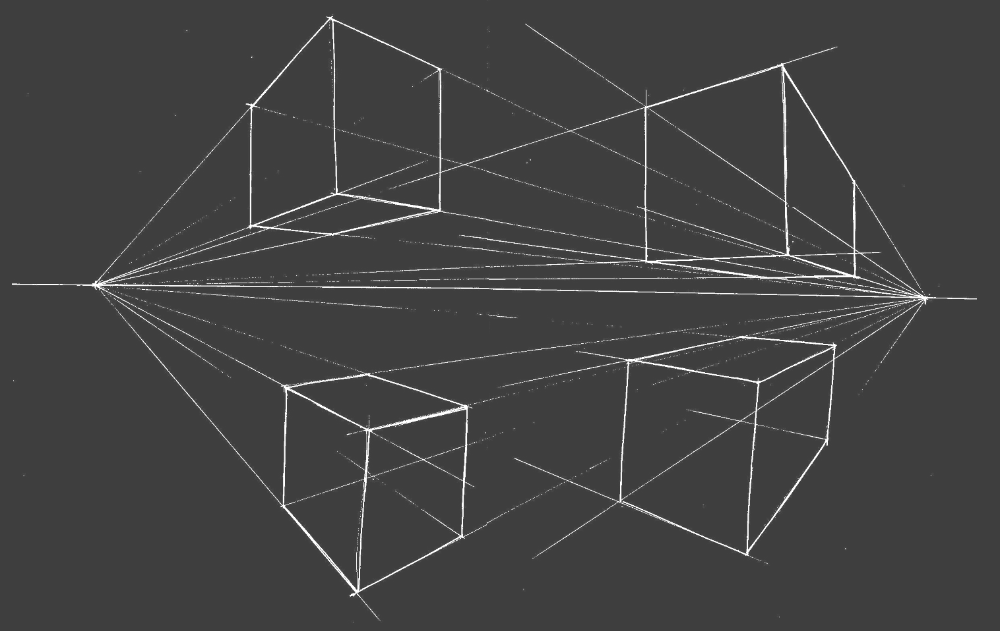

<style>
strong {
--dracula-current-line:#f1fa8c;
color: #f1fa8c;
}

</style>

<style scoped>
section h1 {
    text-align: center;
    height: 100%;
    line-height: 6;
    font-size: 250%;
    text-shadow: 0px 0px 118px rgba(255, 121, 198, 1);
}
</style>



# Arquitectura **CSS (ITCSS)**

---

## Índice
- Arquitecturas (SMACSS, OOCSS, ITCSS, ATOMIC)
- Problemas a resolver
  - SRP, SSOT, O/C
  - especificidad
  - el orden de los ficheros
 
- ITCSS

---
#### Arquitecturas (**SMACSS**, OOCSS, ITCSS, ATOMIC)


SMACSS (Scalable and Modular Architecture for CSS)
El foco de SMACSS es organizar nuestro código en 5 categorías: 
+ `Base:`
   Elementos en la página **(body, html)**
+ `layout:` 
   Divide la página en secciones. Albergan uno o más módulos. **(#article{}, #sidebar{}) ** [`l-*, layout-*`]
+ `modules:` 
  Son las partes modulares reutilizables de nuestro diseño **(AKA componentes).**

---
#### Arquitecturas (**SMACSS**, OOCSS, ITCSS, ATOMIC)

+ `states:` 
  Son formas de describir cómo se verán nuestros módulos cunado esté en un estado particular **(is-active) recomendado el uso de !important** [`is-*`]
+ `theme:`
  son similares a los  statates en el sentido de que describen cómo podrían verse los módulos. **(overrides de modules)**
  
---
#### Arquitecturas (SMACSS, **OOCSS**, ITCSS, ATOMIC)

Se centra en la estructura del código 

Dos principios básicos: 
Separación de la estructura con respecto a la parte cosmética y separación contenedores y contenido

```css
.btn {} 
.btn .error{} 
.btn .active {}
```

---
#### Arquitecturas (SMACSS, **OOCSS**, ITCSS, ATOMIC)

BEM es una aplicación de OOCSS que nos permitirá eliminar el colapso de nombres a la vez que aplana nuestra especificidad

```css
.btn {} 
.btn_error{} 
.btn_active {}
```

+ No sólo intenta separar el contenedor del contenido sino que también intenta separar los estilos de la estructura

---
#### Arquitecturas (SMACSS, OOCSS, **ITCSS**, ATOMIC)

Utiliza **BEM** y se basa en la inversión del triangulo (uso de nuestras reglas de CSS).
Tiene en cuenta la **especificidad** el **orden de inserción de las reglas** y la **organización de los ficheros**

---
#### Arquitecturas (SMACSS, OOCSS, ITCSS, **ATOMIC**)

Define selectores de clases con un solo propósito para cada declaración reutilizable.
Atomic aconseja el uso de valores en los nombres de clase

```css
.Mb(16px) { margin-bottom: 16px; }
.Mb(32px) { margin-bottom: 32px; }  
.C(#1e90ff) { color: #1e90ff; }
```
```html
<div class="ac ax b ce fx fy lz mf mg nq nr ns nt nu q r">
    <div class="nv">
        <h1 class="cf ck id jq nw nx ny nz">N26 The bank you’ll love</h1>
        <a href="#" class="aj av az ba bh ci dv ef ei el en eo ep eq er es 
        et ev ga gb gc gd ge gf gn go gp gq gr gs hx ij ob oc od oe of og oh oi oj r">
   ...
```
---
Problemas a resolver: **especificidad** 

+ 

* 

---
Problemas a resolver: **El orden de los ficheros**

+ A igualdad de especificidad gana el último en ser parseado
  + archivo externo (normal, con preload, con carga asíncrona)
  + en la cabecera
  + en el cuerpo (inline)  

 + &lt;style&gt; Vs Inline => **inline**
 + &lt;link&gt; (preload, **asíncrono**, etc) **antes** &lt;style&gt; => **&lt;style&gt;**
 + &lt;link&gt; (preload, asíncrono, etc) **despues** &lt;style&gt; => **&lt;link&gt;**

---
### Ejemplo : Especificidad de fleet


---


---


---


---
## Inverted Triangle CSS (ITCSS)


---


---
<style scoped>
figure {
  background-position: top right !important; 
  margin: 20px !important;
}
</style>


### Capas de SCSS (no generan salida)

**settings**
  |-- core.scss **($spacing, $base-line, $radious, ... )**
  |-- colors.scss **( $primary, $secondary,...)**


**tools**
  |-- typography.scss **(@mixin font-size())**
  |-- gradients.scss **(@mixin gradient-primary())**

---
<style scoped>
figure {
  background-position: top right !important; 
  margin: 20px !important;
}
</style>


### Capas genéricas
**Generic**
  |-- box-sizing.scss **(html {}, \*:before {})**
  |-- normalize.scss **( nicolas Gallagher)**
  |-- resets.scss **(pequeño)**
  |-- fonts.scss **(@font-face {})** 

---
<style scoped>
figure {
  background-position: top right !important; 
  margin: 20px !important;
}
</style>


### Capas de elementos
**Elements**
  |-- headings.scss **(h1 {@include font-size($font-h1)})**
  |-- page.scss **(body {})**
  |-- images.scss **(img {})**
  |-- anchor.scss **(a {}, a:focus {}, a:visited {})** 

---
<style scoped>
figure {
  background-position: top right !important; 
  margin: 20px !important;
}
</style>

### Capas de objetos
**Objects**
|-- wrapper.scss **(o-wrapper {})**
|-- ratio.scss **(o-ratio {}, .o-ratio > iframe, .o-ratio > embed, .o-ratio > object {} o-ratio--4:3 {} o-ratio--16:9)**
|-- block.scss **(o-block {} o-block__img {}  .o-block--tiny {} .o-block--flush {})**
|-- grid.scss **(o-grid {} o-grid__item {} o-grid--small {})**


---
<style scoped>
figure {
  background-position: top right !important; 
  margin: 20px !important;
}
</style>


### Capas de componentes
**Components**
|-- driverList.scss **(.driverList {})**
|-- avatar.scss **(.avatar{})**
|-- tooltip.scss **(.tooltip{})**


---
<style scoped>
figure {
  background-position: top right !important; 
  margin: 20px !important;
}
</style>


### Capas de utilidades
**Utils**
|-- cols.scss **(.u-col-2 {}, .u-col-4 {})**
|-- widths.scss **(.u-1/6 {}, .u-1/3 {} u-push-1/4 {})**
|-- hide.scss **(.u-hidden {}, .u-hidden-visually { @include..)**
|-- spacing.scss **(.u-top-tiny{} u-padding-large{}  u-margin-horizontal-none {})**

+ Usar siempre **!important**

---
Trabajaremos de forma modular con las capas
+ Importamos los elementos separados. Al tener bien creado nuestro principio de responsabilidad única, cada fichero es independiente y autocontenido.
+ los ficheros sólo dependerán de las 2 primeras capas (settings y tools)    
+ Importaremos las capas en orden pero dentro de cada capa los elementos están aislados y no debería de afectar el orden

---
<style scoped>
p {font-size:28px}
</style>
### Aplicación práctica
// fichero settingsAndTools.scss
// SETTINGS
**$spacing: 16px**
@import "node_modules/ds/settings/settings.core";
@import "impl/settings/custom-config";
...
// TOOLS
@import "node_modules/ds/tools/tools.font-size";
@import "node_modules/ds/tools/tools.clearfix";
@import **"node_modules/sass-mq/mq";**
@import **"impl/tools/measures"**

+ este fichero lo usaremos luego en nuestros componentes

---
<style scoped>
p {font-size:28px}
</style>

// GENERIC
@import "node_modules/normalize/normalize";
@import "node_modules/ds/generic/generic.box-sizing";

// ELEMENTS
@import "node_modules/ds/elements/elements.headings";
@import "node_modules/ds/elements/elements.anchors";
@import **"impl/elements/anchors";**
// ~~@import "node_modules/ds/elements/elements.quotes";~~

// OBJECTS
@import "impl/objects/list-bare";
@import "node_modules/ds/objects/objects.layout";
@import "impl/objects/objects.list-inline";

// COMPONENTS
**... cada oveja con su pareja**

---

// UTILITIES
@import "node_modules/ds/utilities/utilities.widths";
@import "node_modules/ds/utilities/utilities.headings";
// ~~@import "node_modules/ds/utilities/utilities.spacing";~~ 
@import "impl/utilities/spacing";

---
[Atomic CSS](https://acss.io/)
[CSS methodologies](https://www.creativebloq.com/features/a-web-designers-guide-to-css-methodologies#:~:text=OOCSS%20involves%20identifying%20objects%20on,place%2C%20leading%20to%20better%20consistency.)
_Less Web Development Essentials_, Bass Jobsen, ed: Packt Publishing
[SMACSS book](http://smacss.com/files/smacss-en.zip)
[Normalize Vs Reset](https://medium.com/@elad/normalize-css-or-css-reset-9d75175c5d1e)
[Managing projects with ITCSS](https://www.youtube.com/watch?v=1OKZOV-iLj4&t=8m44s)
[inuit CSS](https://github.com/inuitcss/inuitcss) 

---


---
