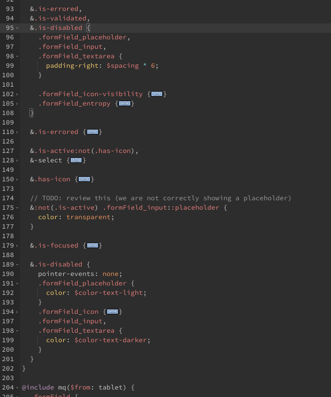

# Single Responsibility Principle

The single responsibility principle states that every class should have a single responsibility, and that responsibility should be entirely encapsulated by the class. All its services should be narrowly aligned with that responsibility.


---
<!-- header: '**Single Responsibility Principle**' -->

## No usar páginas como clases
 * Poco extensible 
 * Introduce comportamientos no esperados al hacer overrides

---
## Ejemplo SRP

```html
<a href="/product" class="promo">Buy now!</a>
```
```css
.promo {
display: block;
padding: 20px;
margin-bottom: 20px;
background-color: #09f;
color: #fff;
text-shadow: 0 0 1px rgba(0,0,0,0.25);
border-radius: 4px;
}
```
<!-- 

* Here we have a class for a promotional box of content. Here we are doing two things.

* We are defining **box model and structure** and we are defining **cosmetics** (colouring etc).
-->

---

We can refactor this code to adhere to the SRP by splitting those two chunks of functionality into two classes:
```css
.island {
display: block;
padding: 20px;
margin-bottom: 20px;
}

.promo {
background-color: #09f;
color: #fff;
text-shadow: 0 0 1px rgba(0,0,0,0.25);
border-radius: 4px;
}
```
<!--
We now have two classes which each carry a single responsibility

.island boxes off content and 

.promo applies our promotional styling.
-->

<!-- _footer: 'Bibliografía: https://csswizardry.com/2012/04/the-single-responsibility-principle-applied-to-css/' -->

---
## Other examples
```scss
.regPlate {
    display: inline-block;
    padding: 5px $spacing 2px 9px;
    min-width: $spacing * 9;
    border: inner 1px $color-action-soft;
    border-radius: $spacing/2;
    color: $color-text-positive-light;
    text-align: center;
    font-size: 14px;
    line-height: 16px;
}
```

---
```scss
.reportBox {
  display: grid;
  padding: $spacing * 2;
  border: 1px solid $color-action-soft;
  border-radius: $radius;
  grid-template-columns: 50% 50%;
  @include typography("body");
}
```

favor function mixins over @includes
dejar de usar `@include typography("body");` en favor de clases funcionales (BEM Mixins)

---
# otro ejemplo en donde no dividimos bien el principio de responsabilidad única
```css
.journey_finishReasonIcon {
  display: inline-table;
  width: 16px;
  height: 16px;
  color: red;
  transform: translateY(1px);
}
.journey_finishReasonIcon-success {
    color: green;
  }
```

```html
<div class="journey_finishReasonIcon"> error icon</div>
<div class="journey_finishReasonIcon journey_finishReasonIcon-success"> success icon</div>
```

* Deberíamos extraer el atributo color y crear un modificador para error. 
Podríamos definir un color por defecto que sería el heredado `color:inherit`  

* otro punto que noe s tan evidente es que esta estructura de colocar un icono posiblemente se repita en muchos otros cosas , por tanto podríamos extraer nuestra clase en un elemento común agnóstico al contexto.

* Y por último en el elemento agnóstico no deberíamos de utilizar `display:inline-table`  
---
## Benefits
- Your CSS is a lot DRYer.
- You can make far-reaching changes to your designs by simply modifying a base abstraction only once.
- You can make safer changes because you know that when editing a class you are only ever altering one responsibility.
- You can combine responsibilities to make a variety of components from a lot of abstracted classes.

---
### <!-- fit --> No usar comas para múltiples selectores
formField_placeholder, formField_input, formField_textarea



---

En una tabla de css-grid podemos tener una estrcutura como esta:
```html
<div class="table">
    ...
    <div class="table-row">
        <div class="table_Cell">lorem</div>
        <div class="table_Cell">ipsun</div>
    </div>
    ...
</div>
```
```css
.table-row {display: contents;}
.table-row:hover .table_cell {background-color: #fe23ee;}
```

---

```html
...
<div class="table">
    ...
    <div class="table-row has-hoverBehaviour">
        <div class="table_Cell">lorem</div>
        <div class="table_Cell">ipsun</div>
    </div>
    ...
</div>
...
```
```css
.table-row { display: contents; }
.table-row .has-hoverBehaviour {cursor: pointer;}
.table-row .has-hoverBehaviour:hover .table_cell {background-color: #fe23ee;}

```

---

<!-- header: '**Single Source of Truth**' -->

# Single Source of Truth
Single source of truth (SSOT) is the practice of structuring information models and associated data schema such that every data element is mastered (or edited) in only one place

SSOT systems provide data that are authentic, relevant, and referable.


---

Uso de modificadores de clases `is-* , has-*` , no se aconseja [BEM](http://getbem.com/faq/#why-the-modifier-classes-are-prefixed). Mejor usar prefijo de clase

Debido a que podemos usar mixins esto llevaría a :
```HTML
<div class="block is-important news "
```
```css
.block {display:block;}
.block.is-important {font-weight: bold;}

.news { font-size: 14px;}
.news.is-important {color:red;}
```

Al aplicar el modificador como usa el mismo nombre en los 2 bloques esto hace que se apliquen los 2 modificadores

---
# <!-- fit --> Uso de mixings funcionales con BEM ( MIX )

https://en.bem.info/methodology/quick-start/#mix

## Ejemplo:

````html
<article class="article">...</article>

<footer class="footer">
    <div class="copyright">...</div>
</footer>

````

````css
.article, .footer div {
font-family: Arial, sans-serif;
font-size: 14px;
color: #000;
}

````

<!-- 
* In this example, the text inside the article and copyright blocks has the same color and font.

* Although group selectors do allow you to quickly change the design of the page, this approach tightens code coupling.

* This is why BEM uses mixes to uniformly format an entire set of HTML elements.
-->

Implementación correcta
```html
<article class="article text">...</article>

<footer class="footer">
    <div class="copyright text">...</div>
</footer>
```
````css
.text {
    font-family: Arial, sans-serif;
    font-size: 14px;
    color: #000;
}
````
---

<!-- _header: Open/closed principle -->

# Open/closed principle
Any HTML element on a page should be open for extension by modifiers, but closed for changes. You should develop new CSS implementations without needing to change existing ones.


```html
    <button class="button">...</button>
    <button class="button">...</button>
```

```css
.button {
    font-family: Arial, sans-serif;
    text-align: center;
    font-size: 11px;
    line-height: 20px;
}
```

* Let's say we need to change the size of a button. According to the open/closed principle, we extend the button.

```html
    <button class="button">...</button>
    <button class="button button-small">...</button>
```
```css
.button {
    font-family: Arial, sans-serif;
    text-align: center;
    font-size: 11px;
    line-height: 20px;
}

.button_size_s {
    font-size: 13px;
    line-height: 24px;
}
```

The existing button functionality is extended using the button-small class (the font-size and line-height properties are redefined). Now the page has two buttons of different sizes.


**Modification by context** 
```css
.button {
    font-family: Arial, sans-serif;
    text-align: center;
    font-size: 11px;
    line-height: 20px;
}

.content .button {
    font-size: 13px;
    line-height: 24px;
}
```

The button design now depends on its location. Changes will apply to all button blocks inside the content block.


